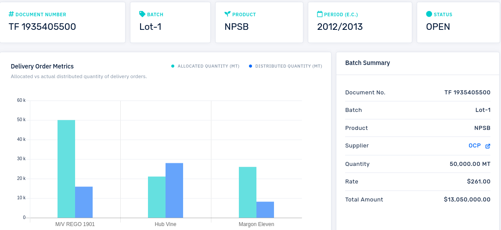

# Woreket Tracker
## A web application for tracking fertilizer payments



### Prerequisites
* [Python 3.8+](https://www.python.org/downloads/)
* [Pipenv](https://pipenv.readthedocs.io/en/latest/)
* [MYSQL 5.7+](https://dev.mysql.com/downloads/mysql/)


### Setting up development environment

1. Clone this repo and change to the directory of the project.
2. Install the project dependencies by running the following command:

   ```bash
   $ pipenv install --dev
   ```
3. Make sure the MySQL Server is up and running.

4. Create a new database. (Example: `woreket_tracker_db`)

5. At the project root directory, there is a file named `.env_example`. Copy the file and rename the copy as `.env`.

6. Open the `.env` file in a text editor and add the following line.

   ```bash
    SECRET_KEY='<django secret key>'
    DB_NAME='woreket_tracker_db'
    DB_USER='<database user name>'
    DB_PASSWORD='<database user password>'
    DB_HOST='<host>'
    DJANGO_SETTINGS_MODULE='<setting module path. Eg. config.settings.local>'

   ```

   **TIP**: To generate a unique secret key value, you can use this [website](https://djecrety.ir/).

7. Save the file.

8. Run fixtures to load initial data.

    ```bash
    $ python manage.py runfixtures
    ```

9. Run the following commands to setup database schema and to create dummy data:

    ```bash
    $ python manage.py migrate
    ```

10. Run the following command to create an `admin` user:

    ```bash
    $ python manage.py defaultsuperuser
    ```

### Usage
1. Run the following command to run the development web server:

    ```bash
    $ python ./manage.py runserver 0.0.0.0:8000
    ```

2. Open a web browser and go to: [http://localhost:8000/admin](http://localhost:8000/admin)


### List of Main Tools and Packages Used
* [Python 3.8+](https://www.python.org/downloads/)
* [Pipenv](https://pipenv.readthedocs.io/en/latest/)
* [Django 2.2](https://www.djangoproject.com/download/)
* [DRF 3.9](https://www.django-rest-framework.org/)
* [django-cors-headers](https://pypi.org/project/django-cors-headers/)
* [celery](https://docs.celeryproject.org/)
* [redis](https://redis.io)
* [Python Decouple](https://github.com/henriquebastos/python-decouple)
* [Travis-CI](https://travis-ci.org/)
* [Gunicorn](https://gunicorn.org/)
* [django-phonenumber-field](https://github.com/stefanfoulis/django-phonenumber-field)
* [python-docx](https://python-docx.readthedocs.io/en/latest/)
* [django-countries](https://github.com/SmileyChris/django-countries/)
